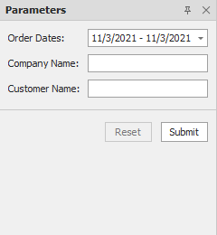
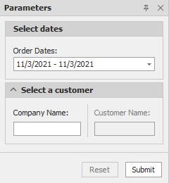

<!-- default badges list -->

<!-- default badges end -->
# Reporting for WinForms - Customize the Parameters Panel

This example uses the [ParameterPanelFluentBuilder](https://docs.devexpress.com/XtraReports/DevExpress.XtraReports.Parameters.ParameterPanelFluentBuilder) class to customize the **Parameters** panel as follows:

1. Unite report parameters into groups and place parameters side-by-side.
2. Place a label and editor vertically for each parameter.
3. Add a separator between parameters inside a group.

The example also specifies an [expression](https://docs.devexpress.com/XtraReports/120091/detailed-guide-to-devexpress-reporting/use-expressions) for the [Enabled](https://docs.devexpress.com/CoreLibraries/DevExpress.XtraReports.Parameters.Parameter.Enabled) property to enable/disable a parameter's editor based on a value of another parameter.

| Default panel | Customized panel |
| :-: | :-: |
|  |  |

<!-- default file list -->
## Files to Look At

- [Form1.cs](./CS/Form1.cs#L17) ([Form1.vb](./VB/Form1.vb#L10))

<!-- default file list end -->

## Documentation

- [ParameterPanelFluentBuilder Class](https://docs.devexpress.com/XtraReports/DevExpress.XtraReports.Parameters.ParameterPanelFluentBuilder)
- [The Parameters Panel](https://docs.devexpress.com/XtraReports/402960/detailed-guide-to-devexpress-reporting/use-report-parameters/parameters-panel)

